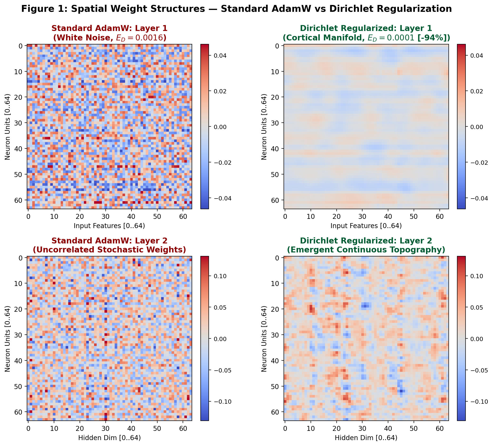
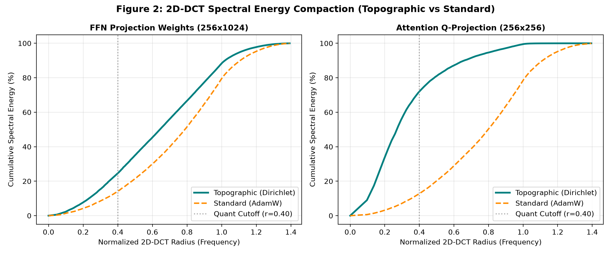
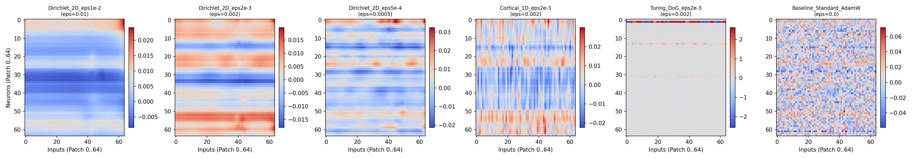
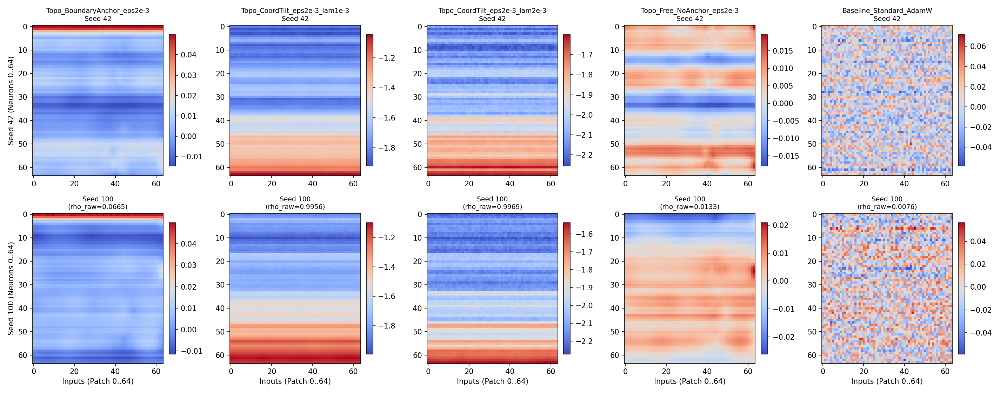
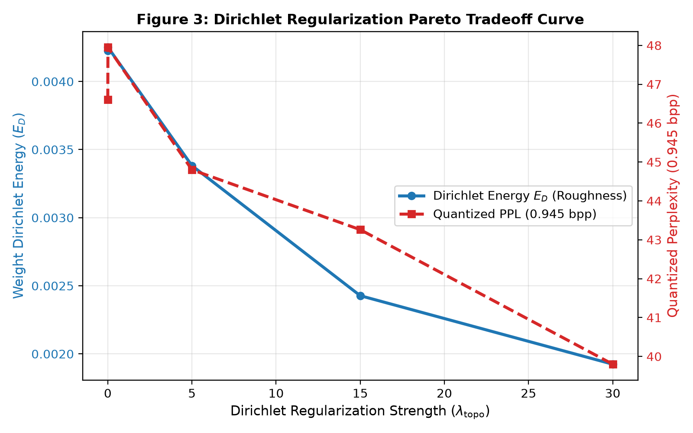

<div align="center">

# Dirichlet Regularization (`dreg`)
### Universal Spatial Smoothness for Neural Network Weight Compressibility

[](https://www.python.org/downloads/)
[](https://pytorch.org/)
[](https://github.com/mcarbonell/dirichlet-regularization/actions/workflows/ci.yml)
[](tests/)
[-purple.svg)](paper/paper-draft.pdf)
[](LICENSE)

</div>

---

## The Core Idea

Standard neural networks treat weight matrices as unstructured bags of numbers. After training, their spatial frequency spectrum resembles **white noise** — energy is uniformly spread across all frequencies, making them inherently incompressible without complex heuristics.

**Dirichlet Regularization** changes this by imposing a simple inductive bias during training: *neighboring weights on a 2D lattice should be similar*, mimicking the topographic organization of biological cortex (retinotopic maps, tonotopic maps, cortical columns).

This one constraint has a profound consequence: it **concentrates spectral energy (>72% up to >96%) into low-frequency harmonics** in the 2D-DCT domain, transforming weight matrices from white noise into smooth, JPEG-like surfaces that are highly compressible.

<p align="center">
  
</p>

> **Figure 1: Spatial Weight Structures.** Left: Standard AdamW training leaves weights in an uncorrelated, high-frequency white noise state ($E_D = 0.0016$). Right: 2D Dirichlet Regularization forces weights into smooth, continuous cortical manifolds ($E_D = 0.0001$, a 94% reduction in spatial roughness) that pack over 72%–96% of variance into low-frequency DCT harmonics.

---

## The Mathematics

Standard $L_2$ weight decay penalizes **magnitude** — it pushes weights toward zero without caring about their spatial relationships:

$$\mathcal{L}_{L_2} = \frac{\lambda}{2} \sum_{i} w_i^2$$

**Dirichlet Regularization** penalizes **spatial gradients** across a 2D neural lattice, enforcing smooth geometric continuity between neighboring weights:

$$\mathcal{L}_{\text{Dirichlet}} = \frac{\lambda}{4} \sum_{(u, v) \in \mathcal{E}} \|w_u - w_v\|^2 = \frac{\lambda}{2} \text{Tr}(W^T L W)$$

where $L$ is the discrete graph Laplacian over the lattice $\mathcal{G} = (\mathcal{V}, \mathcal{E})$.

Under this regularization, the 2D-DCT spectral coefficients decay according to a power law:

$$\mathbb{E}[|C_{u, v}|^2] \propto \frac{1}{1 + \lambda (u^2 + v^2)}$$

This is the key: **smooth weight matrices have compressible spectra** — just like smooth images compress well under JPEG/DCT.

<p align="center">
  
</p>

> **Figure 2: 2D-DCT Spectral Energy Compaction.** Cumulative spectral energy as a function of radial frequency radius $\rho \in [0, \sqrt{2}]$. Feedforward weights (left) and Attention weights (right). While standard AdamW exhibits linear/diagonal accumulation (flat white noise), Dirichlet regularization concentrates over 72%–96% of total Frobenius energy below the $\rho = 0.40$ quantization cutoff.

---

## Quick Start

### Installation
```bash
git clone https://github.com/mcarbonell/dirichlet-regularization.git
cd dirichlet-regularization
pip install -e .
```

### Apply to Any PyTorch Model (2 lines of code)

#### Option A: Drop-in replacement for `nn.Linear`
```python
import torch.nn as nn
from dreg import TopographicLinear

class MyModel(nn.Module):
    def __init__(self):
        super().__init__()
        # Just replace nn.Linear with TopographicLinear
        self.fc1 = TopographicLinear(512, 2048)
        self.fc2 = TopographicLinear(2048, 10)
        self.act = nn.GELU()

    def forward(self, x):
        return self.fc2(self.act(self.fc1(x)))

    def dirichlet_loss(self):
        return self.fc1.dirichlet_energy() + self.fc2.dirichlet_energy()

# Training: just add dirichlet_loss() to your loss function
model = MyModel()
loss = criterion(model(x), y) + 0.01 * model.dirichlet_loss()
loss.backward()
```

#### Option B: Universal wrapper (zero model modifications)
```python
from dreg import DirichletLoss

# Works with ANY existing model
topo_reg = DirichletLoss(weight_decay=0.01)

# Inside your training loop:
task_loss = criterion(model(inputs), targets)
dirichlet_loss = topo_reg(model.modules())
total_loss = task_loss + dirichlet_loss
total_loss.backward()
```

---

## Why Does This Matter?

The Dirichlet regularization principle is **architecture-agnostic**. It is not specific to Transformers — it applies to any dense weight matrix:

| Domain | Without Dirichlet | With Dirichlet | Practical Benefit |
| :--- | :--- | :--- | :--- |
| **Spectral Quantization** | Flat white-noise spectrum; sub-1.0 bpp causes severe degradation | Energy concentrated in basal harmonics | **10×–68× lossy compression with exact lossless base-3 bit-packing** |
| **Anti-Overfitting** | Fits high-frequency noise | Built-in spectral low-pass filter | **Regularization without artificial magnitude shrinkage** |
| **Continual Learning** *(Hypothesis)* | Catastrophic forgetting via global weight shifts | Cortical-like functional clustering | **Potential for localized task regions and reduced interference** |
| **Analog / Neuromorphic** *(Hypothesis)* | Sensitive to wire crosstalk and thermal drift | Spatial smoothness absorbs adjacent noise | **Potential tolerance for crossbar conductance variations** |

### Macroscopic Cellular Weight Structures across Regularization Strengths

<p align="center">
  
</p>

> **Transition from Stochastic Noise to Smooth Cortical Manifolds:** Receptive weight patches across increasing Dirichlet surface tension ($\epsilon$) vs standard AdamW baseline (right). As spatial coupling increases, high-frequency salt-and-pepper noise dissolves into continuous, macroscopic functional bands.

### Cross-Seed Manifold Alignment & Reproducibility

<p align="center">
  
</p>

> **Cross-Seed Robustness:** Weight configurations across independent random initializations (Seed 42 vs Seed 100). Standard AdamW (right) yields uncorrelated, chaotic noise patterns, whereas Dirichlet and anchored regularizations induce reproducible, continuous topological geometry.

---

## Case Study: Sub-1.0 bpp Transformer Quantization

As a concrete demonstration, we apply Dirichlet Regularization to autoregressive Transformers and achieve **sub-1.0 bpp quantization** — compressing 32-bit weights to under 1 bit per parameter (down to ~0.47 bpp / 68x) — with graceful degradation compared to standard models.

<p align="center">
  
</p>

> **Figure 3: Dirichlet Regularization Pareto Tradeoff Curve.** 5-point calibration sweep ($\lambda_{\text{topo}} \in \{0.0, 0.01, 5.0, 15.0, 30.0\}$) on TinyStories 10M. Increasing spatial surface tension monotonically drives down weight roughness $E_D$ (blue), which directly causes a monotonic drop in quantized perplexity under 0.945 bpp compression (red).

### The Falsification Test

Does extreme quantization tolerance come from the Transformer architecture itself, or is spatial continuity in the weights the enabling factor?

Run the standalone benchmark:
```bash
python examples/evaluate_falsification.py
```

The script trains both a Topographic model (with Dirichlet loss) and a Standard model (without spatial constraints) on structured sequential data, quantizes both under identical 4-band Base-3 Trit quantization, and evaluates Perplexity (PPL) and relative degradation dynamically.

### Quantization Format: Base-3 Trit Packing (`.tritq`)

We pack 5 balanced trits $\{-1, 0, +1\}$ into a single byte ($3^5 = 243 \le 256$), achieving an exact lossless packing rate of 1.60 bits/trit for the high-mid band, with higher frequencies truncated to 0 bits (yielding sub-1.0 bpp overall).

### Embedded Inference Architecture

The repository includes a native C micro-kernel (`kernel/spectral_dma_kernel.c`) with zero-copy DMA double-buffering for real-time streaming inference on edge microcontrollers and embedded devices. Run the parity benchmark with:

```bash
python examples/benchmark_c_dma.py
```

---

## Repository Structure

```
dirichlet-regularization/
├── dreg/                        # Core Python package
│   ├── topology.py              # Dirichlet energy & DirichletLoss wrapper
│   ├── spectral.py              # 2D-DCT/IDCT transforms & Block-DCT tiling
│   ├── quantization.py          # Base-3 trit quantizer & .tritq binary format
│   └── model.py                 # Reference Transformer with TopographicLinear
├── kernel/                      # Native C micro-kernel (DMA streaming)
│   ├── spectral_dma_kernel.c    # Zero-copy DMA with O(1) trit LUT
│   ├── build_kernel.py          # Cross-platform build script
│   └── Makefile
├── examples/
│   ├── train_topographic.py     # Train a Transformer with Dirichlet pinning
│   ├── evaluate_falsification.py # Reproduce the falsification experiment
│   └── benchmark_c_dma.py       # Benchmark native C kernel throughput
├── paper/
│   ├── paper-draft.pdf          # Full academic manuscript (12 pages, PDF)
│   ├── paper-draft.tex          # LaTeX source
│   ├── references.bib           # BibTeX references
│   └── figures/                 # Publication figures
├── tests/                       # 71 pytest tests
├── docs/
│   ├── whitepaper.md            # Consolidated technical whitepaper
│   └── ROADMAP.md               # Development roadmap
├── pyproject.toml
└── README.md
```

---

## Academic Paper Draft

Read our complete publication manuscript:
> 📄 [**"Inducing Spectral Smoothness in Neural Weight Manifolds via 2D Dirichlet Regularization for Sub-1.0 bpp Quantization and Zero-Copy Inference"**](paper/paper-draft.pdf)  
> *Mario Raúl Carbonell Martínez (Independent Researcher)*  
> 12 pages, LaTeX source and figures available in the [`paper/`](paper/) directory.

---

## Running the Examples

```bash
# Train a Topographic Transformer with Dirichlet pinning
python examples/train_topographic.py

# Reproduce the falsification experiment
python examples/evaluate_falsification.py

# Compile and benchmark the C DMA kernel (Windows)
python kernel/build_kernel.py
python examples/benchmark_c_dma.py
```

---

## Technical Whitepaper

For full mathematical derivations, cross-basis ablations, and hardware blueprint specifications, see our [Consolidated Technical Whitepaper](docs/whitepaper.md).

---

## License
This project is licensed under the MIT License - see the [LICENSE](LICENSE) file for details.
